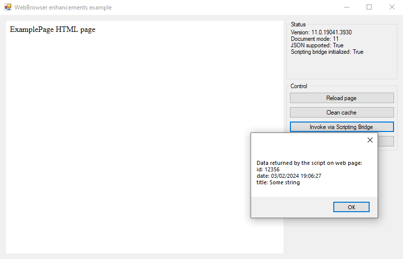

WebBrowser Tools
=================

[](https://www.nuget.org/packages/Vereyon.Windows.WebBrowser/)

Vereyon's Windows.WebBrowser is a helper library for controlling and enhancing the `System.Windows.Forms.WebBrowser` control which embeds Microsoft Internet Explorer. It improves JavaScript interoperability and enables controlling the IE version and GPU acceleration.



Documentation
-------------

### Scripting Bridge

The `ScriptingBridge` is a utility which makes it possible to invoke JavaScript member functions in the embedded browser and to receive return values and objects. This is in contrast to the `HtmlDocument.InvokeScript()` method which can only invoke global functions. It also provides enhanced error handling by for example differentiating between a not found function and a function returning void.

#### Usage

If you for example want to invoke `myObject.myFunction` as defined in the following JavaScript snippet:

```javascript
var myObject = {
	memberFunction: function()
	{
		return "some result";
	}
};
```

You can do so using the `ScriptingBridge` as follows where `webBrowser` is your `System.Windows.Forms.WebBrowser` instance:

```C#
var bridge = new ScriptingBridge(webBrowser, true);
var result = bridge.InvokeFunction<string>("myObject.myFunction", parameter);
```

### Internet Feature Control

The `InternetFeatureControl` is a utility class which can be used to control features of the `System.Windows.Forms.WebBrowser` control.

#### Browser emulation

Using `InternetFeatureControl.SetBrowserEmulation()` the Internet Explorer rendering engine version can be controlled.

#### GPU acceleration

Using `InternetFeatureControl.SetGpuRendering()` GPU acceleration for rendering can be enabled and disabled.


### WinInet Cache Control

The `WinInetCacheControl` is a utility class which can be used to controle the WinInet cache.

Using `InternetFeatureControl.ClearCache()` the WinInet cache can be fully cleared.

Frequently asked questions
--------------------------

### How do I know if the Scripting Bridge is initialized?

The ScriptingBridge object provides both a property and an event for this purpose. The `ScriptingBridge.IsInitialized` property will be set to `true` once the scripting bridge is initialized. The `ScriptingBridge.Initialized` event is invoked once initialization is completed.

### I want to provide extra services to my code but ScriptingBridge is in the way.

Since you can set only one `ScriptingObject` on the webbrowser and you are required to set it to a `ScriptingBridge` instance in order for the bridge to work you are left with no direct method to expose extra services to the web page.

A straightforward solution is to extend the `ScriptingObject` and to expose your services from there derived class.

### What version of Internet Explorer is WebBrowser running?

This is a dreaded question for WebBrowser users and a lot has been written about controlling this version. The Scripting Bridge will magically tell you where in history you are after initialization via the `ScriptingBridge.DocumentMode` property.

Design
------

The design of the library is discussed in detail in the article [Overcoming WebBrowser control scripting limitations with ScriptingBridge](docs/article.md).

Unit tests
----------

See the Windows.WebBrowser.Tests project for xUnit based unit tests.


More information
----------------

 * [Internet Feature Control Keys on MSDN](https://msdn.microsoft.com/en-us/library/ee330720%28v=vs.85%29.aspx)
 * [Controlling WebBrowser Control Compatibility on MSDN Blog](http://blogs.msdn.com/b/patricka/archive/2015/01/12/controlling-webbrowser-control-compatibility.aspx)
 * [Web Browser Control – Specifying the IE Version](https://weblog.west-wind.com/posts/2011/May/21/Web-Browser-Control-Specifying-the-IE-Version)

License
-------

[MIT X11](http://en.wikipedia.org/wiki/MIT_License)
