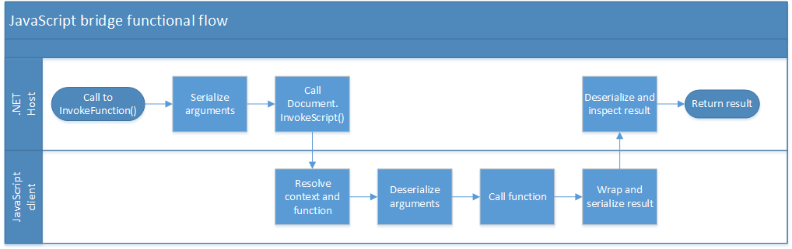

# Overcoming WebBrowser control scripting limitations with ScriptingBridge

Tightly coupling .NET code and browser side JavaScript is difficult with the WebBrowser control. ScriptingBridge was designed to overcome these limitations.

## Introduction

While the WebBrowser control works more or less out of the box for displaying simple web pages, it does have its quirks. Alternative embeddable WebBrowsers for .NET are long available, but `WebBrowser` was long the only one supported by Microsoft on the .NET Framework.

One key difficulty I found is creating a tight coupling between browser side JavaScript code and the .NET world hosting the WebBrowser control. To overcome the numerous limitations I developed the Scripting Bridge which I present to you here.

The key limitations of the WebBrowser’s `Document.InvokeScript()` function fixed by the ScriptingBridge are:

1. Calling functions on any object, not just in the global context.
1. Passing data back and forward without having to make it rain ComVisible attributes.
1. Did my void returning JS function get called or did an error occur?

## Internals

This section will dive deeper in the design and inner workings of the Scripting Bridge. The following figure provides an overview of the functional design of the Scripting Bridge:



### The call gate

Central to the Scripting Bridge is the client side call gate. The call gate is tasked with decoding requests from the host, calling the actual JavaScript function and passing the result back to the host in a useful manner. In addition to this the call gate must be able to provide basic feedback to the host in case errors occur. It forms the glue between the host and the client side.

```javascript
// Define the call gate in the window scope to make it accessable to the .NET world.
callGateName = "__scriptingBridge__callGate";
window[callGateName] = function () {
    return invoke.apply(self, arguments);
}
```

The call gate must make its presence known to the `ScriptingBridge` instance at page load. To this end the Scripting Bridge provides the following COM visible function:

```C#
[ComVisible(true)]
public bool RegisterClient(string args)
```

The args parameter contains a JSON string which contains basic configuration and information about the client side environment. The most important parameter is the name under which the call gate is available on the global window object. This will be the function name `Document.InvokeScript()` will be calling behind the scenes.

### Calling arbitrary methods

The `Document.InvokeScript()` method provided by the WebBrowser control has the major disadvantage that it can only call functions in the global context. It does not allow to call any member functions of objects.

The way to overcome this is to have the gall gate resolve the context of the object. By passing the target function in the format of “namespace.object.function” and splitting on the dots, the call gate obtains the following list of string pieces: { “namespace”, “object”, “function” }. The call gate assumes that the last piece is the name of the function and that any parts before it define the context. The context is resolved iteratively by first looking for the first piece “namespace” in the global context and then for “object” as a member of “namespace”, and so forth. In code this looks as follows:

```javascript
// The root context is assumed to be the window object. The last part of the method parameter is the actual function name.
var context = window;
var namespace = method.split('.');
var func = namespace.pop();

// Resolve the context
for (var i = 0; i < namespace.length; i++) {
    context = context[namespace[i]];

       // Check if the context is defined so far.
       if(context == undefined)
       {
             return JSON.stringify({
                    success: false,
                    error: namespace.slice(0, i + 1).join('.') + ' is undefined.'
             });
       }
}

...

// Call the function.
result = context[func](args);
```

### Injecting script dependencies

Given the design of the Scripting Bridge, it is required to ensure that the client side of the scripting bridge is available in the webpage. One way to ensure this is to include the code for polyfills in every webpage using conventional means. In addition, the `JSON` object may not be available when running Internet Explorer in some older compatibility modes.

In order to not have to deal with including these script in every viewed page in looked into a method to inject these scripts via the Scripting Bridge itself. It turned out that calling the JavaScript `eval()` function with the required script source code as an argument works pretty well.

### Avoiding having to deal with COM objects

Passing objects using the `Document.InvokeScript()` function is perfectly possible. You just need to make sure that everything you pass is visible to COM using the `ComVisible` attribute and make sure that any member methods which should not be callable from the JavaScript code are properly made invisible.

I did not want to have to deal with this, thus I made the Scripting Bridge serialize any passed arguments as JSON. As an added bonus I could do away with having to put my arguments in an object array all the time when calling `Document.InvokeScript()`.

When returning an object from client side JavaScript to the host side this data will be exposed as a COM object for anything that is not a primitive data type. While perfectly possible, working with COM objects is experienced as very challenging by many programmers and can be cumbersome.

I wanted to be able to pass arbitrary data from client side JavaScript to the host side without any hassle. In order to do so I decided to let the call gate serialize any returned data as JSON and to deserialize this data again on the host side. By making this implementation generic, it allows deserialization straight to a strongly typed data model without requiring further mapping.

### Differentiating between void returned and errors

The `Document.InvokeScript()` has the annoying property that it returns `null` in case an error occurs. This makes it impossible to tell the difference between an error occurring and a function simply returning null or nothing. The correct execution of the following code for example would not be discernible from an error occurring:

```javascript
function voidReturn()
{
     // Do some stuff
     return;
}
```

In order to deal with this, the client side of the scripting bridge wraps every function call result in an object explicitly indicating if an error occurred and the returned value. If an unrecoverable error occurs `Document.InvokeScript()` will return null and the host side of the scripting bridge can tell that something really went wrong.

### Supporting custom JSON serialization settings

As mentioned ScriptingBridge leverages JSON to pass internal data structures between the client and host side. The great JSON.Net library from Newtonsoft was used to perform host side serialization and deserialization. Later I replaced this with the System.Text.Json library.

Frequently, the mapping from JSON to .NET objects is not completely straight forward. Think about the exact object member naming conventions. Do you use camel case, or upper case, and is this equal in both your JavaScript and .NET code? To avoid forcing any specific convention on the user, the JSON serialization settings for the payload data are exposed via the `JsonSerializerSettings` property.